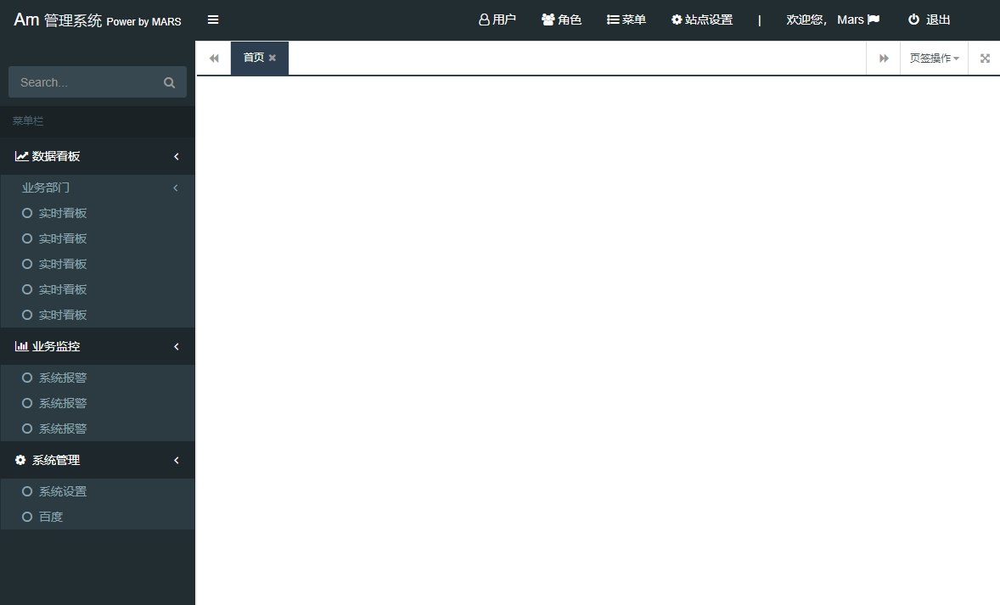

# Am管理系统 iframe 单页框架 

## 项目介绍

一个单页并具有 iframe 的菜单后台轻量级框架。使用只需要通过一个配置或一个api获得menu数据即可使用。

### 功能介绍

+ 通过传入 菜单树状配置实体 组建菜单。
+ 菜单可以是虚拟的、外部链接、内部链接等
+ 提供多标签支持

### 适用场景

 适用于 nodejs、C#、java 等各类管理后台项目，只需要配置菜单，或者经过权限接口得到菜单之后绑定即可，然后里面的其它功能都分别开发就好了。

 配合 vue、react、jquery、layer 等均可以了，后端人员只需要少量简单的组合就可以成为一个系统。


### 截图


### 配置说明

关于如何设置菜单数据：

#### 方式 1：

```
// 通过 js 文件静态配置
adminlte/js/app_menu_config.js

```

#### 方式 2：

```
// 通过 api 接口动态获得数据
// 详情可以浏览 adminlte/js/app.js 中的 showSidebarMenu 函数

```


### 补充说明

关于如何在子页面打开新窗口：

#### 方式 1：
```
// 在子页面引入下面的js，这个包含了 添加、关闭、刷新 方法，你可以自行拓展它
tab.util.js

// 调用方法：
// 打开外网地址
Util.addTab('https://baidu.com','baidu','百度',true});
// 打开相对地址
Util.addTab('/test/404.html','404','404感受一下'});
// 关闭当前子页面
Util.closeTab();
```

#### 方式 2：

```
// 子页面中直接编辑代码
function addTapParent(id) {
    var url = 'https://......';
    var options =  {
        "id": ".....",
        "title": ".....",
        "close": true,
        "url": url,
        "urlType": "relative"
    }
    window.parent.addTabs(options);
}
```

